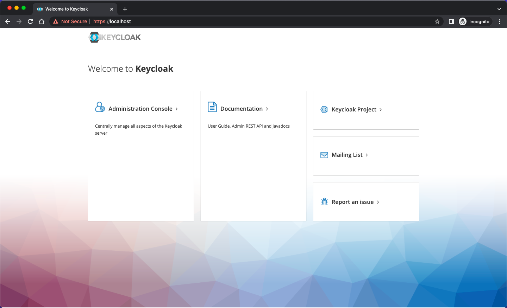

## HOWTO - installing Keycloak with PostgreSQL-HA

### A step by step tutorial

## Step 1: Create a Kubernetes namespace for Keycloak

```bash
kubectl create namespace hbr-keycloak
```
---

## Step 2: Add Helm repo and update it

```bash
helm repo add bitnami https://charts.bitnami.com/bitnami
helm repo update
```
---

## Step 3: Create Secrets

* Keycloak Admin Password

```bash
KEYCLOAK_ADMIN_PASSWORD=$(echo -n "password")

kubectl create secret generic keycloak-admin-password \
  --from-literal=password=$KEYCLOAK_ADMIN_PASSWORD \
  -n hbr-keycloak
```

* PostgreSQL, PgPool, and RepMgr Passwords

```bash
POSTGRES_PASSWORD=$(openssl rand -hex 16 | base64 | tr -d '\n')
REPMGR_PASSWORD=$(openssl rand -hex 16 | base64 | tr -d '\n')
PGPOOL_ADMIN_PASSWORD=$(openssl rand -hex 16 | base64 | tr -d '\n')

kubectl create secret generic postgresql-secret \
  --from-literal=password=$POSTGRES_PASSWORD \
  --from-literal=repmgr-password=$REPMGR_PASSWORD \
  -n hbr-keycloak

kubectl create secret generic pgpool-secret \
  --from-literal=admin-password=$PGPOOL_ADMIN_PASSWORD \
  -n hbr-keycloak

```
---

## Step 4: Install PostgreSQL

Create YAML named `postgresql-values.yaml` and reference it in the helm installation below.

```yaml
global:
  storageClass: "standard"

auth:
  adminUser: "admin"
  existingSecret: "keycloak-admin-password"
  passwordSecretKey: "password"
production: true
proxy: edge

externalDatabase:
  host: "postgresql-ha-pgpool.hbr-keycloak.svc.cluster.local"
  port: 5432
  user: "postgres"
  password: null
  existingSecret: "postgresql-secret"
  existingSecretPasswordKey: "password"
  database: "postgres"
persistence:
  enabled: true
  size: "8Gi"

postgresql:
  enabled: false
```

```bash
helm install postgresql-ha bitnami/postgresql-ha \
  --namespace hbr-keycloak \
  -f postgresql-values.yaml
```

**Hint**: your storage class might be different, so change the parameter value accordingly.

---

## Step 5: Create Certificate Authority, TLS key and certificate

* Create a private key

```bash
openssl genrsa -out tls.key 2048
```
* Create a CSR

```bash
openssl req -new -key tls.key -out tls.csr
```

* Create a CA certificate

```bash
openssl req -new -x509 -keyout ca.key -out ca.crt -days 365 -subj '/CN=localhost'
```

* Sign the CSR with the CA certificate to create server certificate

```bash
openssl x509 -req -in tls.csr -CA ca.crt -CAkey ca.key -CAcreateserial -out tls.crt -days 365
```
* Create a new secret to hold the TLS key and certificate

```bash
kubectl create secret tls keycloak-tls-secret \
  --namespace hbr-keycloak \
  --key tls.key \
  --cert tls.crt
```

*Hint*: a simpler setup without CA/CSR is shown at the end of this document. Use it if you don't need CA/CSR.

## Step 6: Install Keycloak

Create YAML named `keycloak-values.yaml` and reference it in the helm installation below.

Here we're referencing the secret we created previously to set the admin password.

We're also using the `extraInitContainers` and `extraContainers` sections to run additional containers in the Keycloak pod. The `extraInitContainers` section runs a container that waits for the pgpool service to be available before starting Keycloak. The `extraContainers` section runs a container that modifies the `/etc/hosts` file to include the `pgpool` service host name.

```yaml
postgresql:
  username: "postgres"
  password: null
  existingSecret: "postgresql-secret"
  database: "postgres"
  resources:
    limits:
      cpu: "1"
      memory: "1Gi"
    requests:
      cpu: "500m"
      memory: "512Mi"

repmgr:
  password: null
  existingSecret: "repmgr-secret"

pgpool:
  adminUsername: "admin"
  adminPassword: null
  existingSecret: "pgpool-secret"
  resources:
    limits:
      cpu: "500m"
      memory: "256Mi"
    requests:
      cpu: "250m"
      memory: "128Mi"

metrics:
  enabled: true
  resources:
    limits:
      cpu: "300m"
      memory: "128Mi"
    requests:
      cpu: "100m"
      memory: "64Mi"
```

```bash
helm install keycloak bitnami/keycloak \
  --namespace hbr-keycloak \
  -f keycloak-values.yaml
```

## Step 7: Configure NGINX-Ingress

* Create a YAML named `keycloak-ingress.yaml`

```yaml
apiVersion: networking.k8s.io/v1
kind: Ingress
metadata:
  name: keycloak-ingress
  namespace: hbr-keycloak
  annotations:
    nginx.ingress.kubernetes.io/ssl-redirect: "true"
spec:
  tls:
  - secretName: keycloak-tls-secret
  rules:
  - host: YOUR_HOSTNAME
    http:
      paths:
      - path: /
        pathType: Prefix
        backend:
          service:
            name: keycloak
            port:
              name: http
```

**Hint**: replace YOUR_HOSTNAME with the DNS name of your host. For local k8s instances just use localhost.

* Apply this configuration with `kubectl apply -f keycloak-ingress.yaml`

Now open your browser on https://localhost

You should see this page.



---

## Alternative Setups

### ClusterIssuer

In more realistic scenarios one would need a ClusterIssuer to automatically generate TLS certificates for Ingress.

Here's one example how this could be done:

* Create a separate namespace for cert-manager

```bash
kubectl create namespace cert-manager
```
* Add Jetstack's Helm repo

```bash
helm repo add jetstack https://charts.jetstack.io
helm repo update
```
* Install the mandatory CRDs and the cert-manager

```bash
kubectl apply -f https://github.com/cert-manager/cert-manager/releases/download/v1.11.1/cert-manager.crds.yaml
```

```
helm install cert-manager jetstack/cert-manager \
  --namespace cert-manager \
  --version v1.11.1
```

* Create a ClusterIssuer YAML named `cluster-issuer.yaml`. It will use the `Let's Encrypt` prod server.

```bash
apiVersion: cert-manager.io/v1
kind: ClusterIssuer
metadata:
  name: letsencrypt-prod
spec:
  acme:
    email: YOUR_EMAIL
    server: https://acme-v02.api.letsencrypt.org/directory
    privateKeySecretRef:
      name: letsencrypt-prod
    solvers:
      - http01:
          ingress:
            class: nginx
```

Apply it to your cluster with `kubectl apply -f cluster-issuer.yaml -n cert-manager`

* Configure Ingress to use ClusterIssuer

Create a YAML named `ingress.yaml` with these content:

```yaml
apiVersion: networking.k8s.io/v1
kind: Ingress
metadata:
  name: keycloak-ingress
  annotations:
    kubernetes.io/ingress.class: "nginx"
    nginx.ingress.kubernetes.io/ssl-redirect: "true"
    nginx.ingress.kubernetes.io/backend-protocol: "HTTP"
    cert-manager.io/cluster-issuer: letsencrypt-prod
spec:
  tls:
    - hosts:
        - YOUR_DOMAIN
      secretName: letsencrypt-prod
  rules:
    - host: YOUR_DOMAIN
      http:
        paths:
          - path: /
            pathType: Prefix
            backend:
              service:
                name: keycloak-http
                port:
                  name: http
```

Apply this YAML with `kubectl apply -f ingress.yaml -n YOUR_NAMESPACE`

### ClusterIssuer for self-signed certificates

In local environments the usage of ClusterIssuers with Let's Encrypt and other providers is not possible because no real domain is in use. Therefore, we have to change the behavior of ClusterIssuer to make it issue self-signed certificates.

* Create a ClusterIssuer YAML named `cluster-issuer-selfsigned.yaml`.

```yaml
apiVersion: cert-manager.io/v1
kind: ClusterIssuer
metadata:
  name: selfsigned
spec:
  selfSigned: {}
```

Apply the changes with `kubectl apply -f cluster-issuer-selfsigned.yaml -n cert-manager`

* Optionally, create a Certificate resource with your custom fields. Save it as `selfsigned-certificate.yaml`

```yaml
apiVersion: cert-manager.io/v1
kind: Certificate
metadata:
  name: YOUR_DOMAIN-certificate-tls
  namespace: YOUR_NAMESPACE
spec:
  secretName: YOUR_DOMAIN-certificate-tls
  issuerRef:
    name: selfsigned
    kind: ClusterIssuer
  dnsNames:
    - YOUR_DOMAIN
  subject:
    organizations:
      - YOUR ORGANIZATION
    countries:
      - YOUR COUNTRY
    localities:
      - YOUR CITY
    provinces:
      - YOUR STATE
```

Apply it with `kubectl apply -f selfsigned-certificate.yaml -n hbr-keycloak`

This resouce is not mandatory but it makes self-signed certificates look a bit more realistic.

* Update your NGINX-Ingress YAML to point at the certificate.

```yaml
apiVersion: networking.k8s.io/v1
kind: Ingress
metadata:
  name: keycloak-ingress
  namespace: hbr-keycloak
  annotations:
    kubernetes.io/ingress.class: "nginx"
    nginx.ingress.kubernetes.io/ssl-redirect: "true"
    nginx.ingress.kubernetes.io/backend-protocol: "HTTP"
spec:
  tls:
  - hosts:
    - localhost
    secretName: selfsigned-tls
  rules:
  - host: localhost
    http:
      paths:
      - path: /
        pathType: Prefix
        backend:
          service:
            name: keycloak
            port:
              name: http
```
Apply the modified YAML with `kubectl apply -f MODIFIED_YAML -n hbr-keycloak`

---

### Alternative Ingress Setup

You could also configure ingress during the Keycloak installation.

```bash
helm install keycloak bitnami/keycloak \
  --namespace keycloak \
  -f keycloak-values.yaml \
  --set ingress.enabled=true \
  --set ingress.annotations."nginx\.ingress\.kubernetes\.io/ssl-redirect"="true" \
  --set ingress.annotations."nginx\.ingress\.kubernetes\.io/secure-backends"="false" \
  --set ingress.annotations."nginx\.ingress\.kubernetes\.io/backend-protocol"="HTTP" \
  --set ingress.hosts[0].name="localhost" \
  --set ingress.hosts[0].tls=true \
  --set ingress.hosts[0].tlsSecret="tls-secret" \
  --set ingress.hosts[0].tlsKey="tls.key" \
  --set ingress.hosts[0].tlsCert="tls.crt"
```
---

### Alternative TLS setup

#### In case you don't need a CA

* Create keys

```bash
openssl req -newkey rsa:2048 -nodes -keyout tls.key -x509 -days 365 -out tls.crt -subj "/CN=localhost"
```
* Create environment variables

```bash
TLS_KEY=$(cat tls.key | base64 | tr -d '\n')
TLS_CRT=$(cat tls.crt | base64 | tr -d '\n')
echo $TLS_KEY
echo $TLS_CRT
```
* Copy/paste contents of TLS_KEY and TLS_CERT into the Secret YAML named `keycloak-tls-secret.yaml`

```yaml
apiVersion: v1
kind: Secret
metadata:
  name: keycloak-tls-secret
type: kubernetes.io/tls
data:
  tls.key: COPIED_TLS_KEY_CONTENT_HERE
  tls.crt: COPIED_TLS_CRT_CONTENT_HERE
```
* Create Secret with: `kubectl apply -f keycloak-tls-secret.yaml -n hbr-keycloak`

---

#### An even shorter alternative would be:

```bash
openssl req -x509 -nodes -days 365 -newkey rsa:2048 -keyout tls.key -out tls.crt -subj "/CN=localhost"
kubectl create secret tls keycloak-tls-secret --namespace hbr-keycloak --key tls.key --cert tls.crt
```

Then continue with step  6.